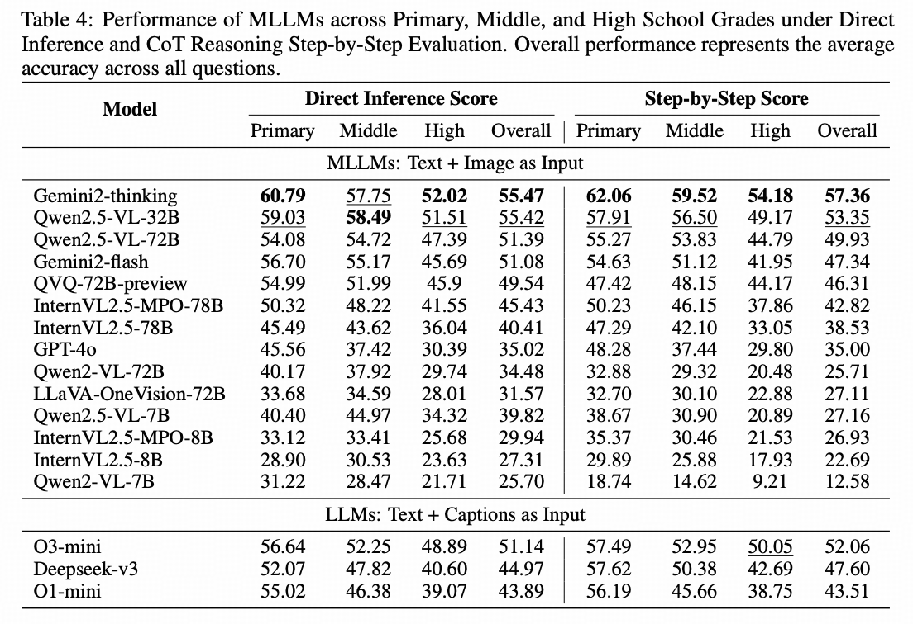

# K12-Vista

[**Quickstart**](README.md) | [**Datasets**](#-datasets) | [**Leaderboard**](#-leaderboard) | [**Report**](https://arxiv.org/abs/2506.01676) | [**Citation**](#-citation)

This repository is the official implementation of [K12-Vista](https://arxiv.org/abs/2506.01676).

> [K12Vista: Exploring the Boundaries of MLLMs in K-12 Education](https://arxiv.org/abs/2506.01676)  
> Chong Li*, Chenglin Zhu*, Tao Zhang*, Mingan Lin†, Zenan Zhou†, Jian Xie† <br>
> <sup>\*</sup> Equal Contribution  
> <sup>†</sup> Corresponding Author

## News

- **[2025-06-01]** The technical report of [K12-Vista](https://arxiv.org/abs/2506.01676) is released!

## Introduction

Multimodal large language models (MLLMs) have demonstrated remarkable reasoning capabilities in various visual tasks. However, their abilities in K12 (Grades1–12) scenarios are still systematically underexplored. Previous studies suffer from various limitations including narrow subject coverage, insufficient data scale,lack of diversity in question types, and naive answer-centric evaluation method, resulting in insufficient exploration of model capabilities. To address these gaps, we propose K12Vista, the most comprehensive multimodal benchmark for Chinese K12 subject knowledge understanding and reasoning to date, featuring 33,000 questions across five core subjects from primary to high school and three question types. Moreover, beyond the final outcome, we are also concerned with he correctness of MLLMs’ reasoning processes. For this purpose, we meticulously compiles errors from MLLMs’ reasoning processes and leverage an automated data pipeline to construct K12-PEM-800K, the largest process evaluation dataset offering detailed step-by-step judgement annotations for MLLMs’ reasoning. Subsequently, we developed K12-PEM, an advanced process evaluation model that integrates an overall assessment of both the reasoning process and answer correctness. Moreover, we also introduce K12-PEBench, the first highquality, human-annotated benchmark specifically designed for evaluating abilities of reasoning process evaluation. Extensive experiments reveal that current MLLMs exhibit significant flaws when reasoning within K12Vista, providing critical insights for the development of more capable MLLMs. We open our resources at https://github.com/lichongod/K12Vista.

## Quick Start

Please refer to [K12-Vista](README.md) for your quick start.

K12-Vista

First, you need to start the vllm service using `K12_Vista/script/vllm_infer_model_setup.sh`, then register the model name in `K12_Vista/code/model_dict.py`. After that, refer to `K12_Vista/script/infer_eval.sh` for inference. For evaluation, you need to first start the vllm service for the judgemodel by `K12_Vista/script/vllm_qwen25_vl_72b_instruct_judgemodel_setup.sh` and `K12_Vista/script/vllm_K12_PEM_judgemodel_setup.sh`, and then refer `eval.py` function in the `infer_eval.sh` to eval.

K12-PEMBench

First, you need to start the vllm service using `K12_PEMBench/script/vllm_K12_PEM_judgemodel_setup.sh`, then register the model name in `K12_PEMBench/code/model_dict.py`. After that, refer to `K12_PEMBench/script/qwen25_vl_72b.sh` for inference and evaluation.

<a id="-datasets"></a>
## Datasets and K12-PEM

K12-Vista, K12-PEMBench, and K12_PEM800K are in https://huggingface.co/datasets/lipku1999/K12-Vista
K12-PEM is in https://huggingface.co/lipku1999/K12-PEM

<a id="-leaderboard"></a>
## Leaderboard



<a id="-citation"></a>
## 🖊️ Citation 
If you feel K12Vista in your project or research, please kindly use the following BibTeX entry to cite our paper. Thanks!
```bibtex
@misc{li2025k12vistaexploringboundariesmllms,
      title={K12Vista: Exploring the Boundaries of MLLMs in K-12 Education}, 
      author={Chong Li and Chenglin Zhu and Tao Zhang and Mingan Lin and Zenan Zhou and Jian Xie},
      year={2025},
      eprint={2506.01676},
      archivePrefix={arXiv},
      primaryClass={cs.AI},
      url={https://arxiv.org/abs/2506.01676}, 
}
